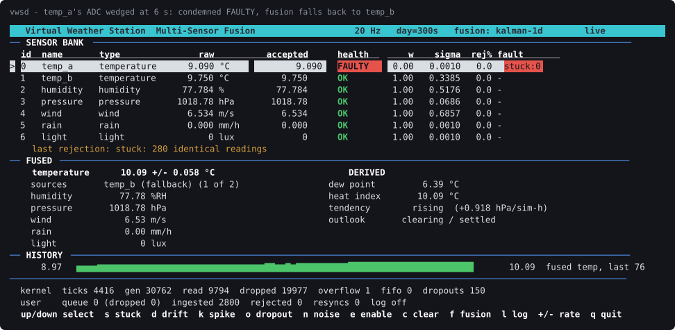
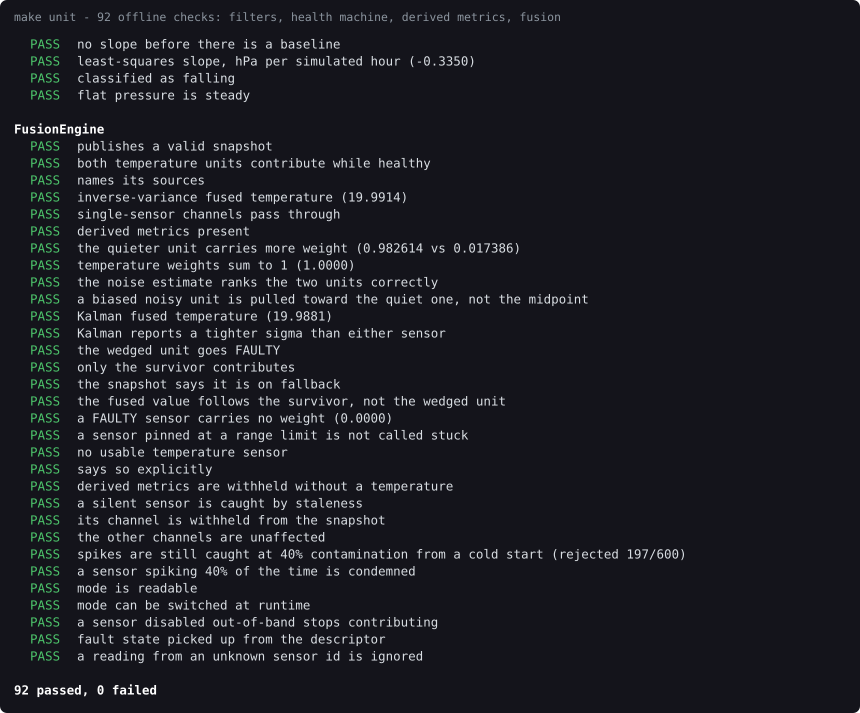
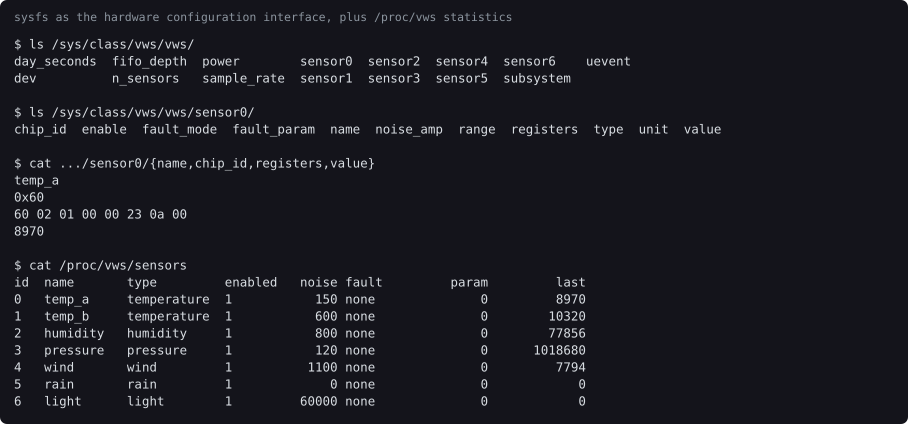
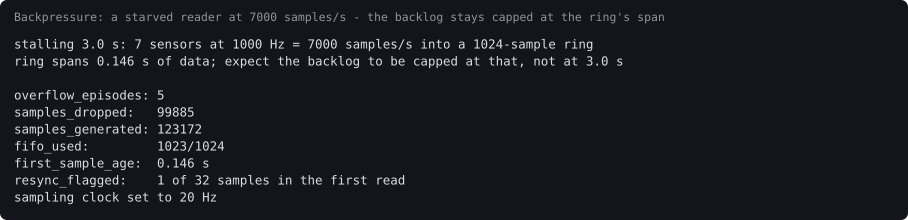

# Virtual Weather Station Multi-Sensor Fusion Engine

A Linux character driver that emulates a bank of weather sensor chips —
register maps, sampling clock, failure modes — and a C++17 engine that
filters, health-checks and fuses their output into one reading you would
actually trust.

The interesting part of a weather station is the logic that turns several
cheap, noisy, occasionally broken sensors into a single trustworthy number.
That logic cannot be written or tested without hardware that misbehaves on
demand, and you cannot ask a real BME280 to wedge its ADC on cue. This project
supplies the hardware.



*`temp_a`'s ADC wedges six seconds in. The health monitor condemns it on
repeated identical readings — the one signal that can catch a fault whose
every value is individually plausible — its fusion weight drops to zero, and
the station carries on with `temp_b`.*

---

## Documentation

| Document | What it covers |
| --- | --- |
| **[PRD](docs/PRD.md)** | Problem, goals, users, numbered requirements, acceptance criteria, traceability matrix, known limitations |
| **[Design notes](docs/DESIGN.md)** | Why no floating point in the kernel, lock discipline, the filter and fusion mathematics, backpressure, fault modes, data structures |
| **[UML](docs/UML.md)** | Class, sequence (×2), state machine (×2) and component diagrams |
| **[All diagrams on one page](docs/diagrams.html)** | Contact sheet of every diagram and screenshot |

## Architecture

```
┌──────────────────────── USER SPACE (C++17) ──────────────────────────────┐
│  Dashboard (ncurses)              vwsctl (config, fault injection)       │
│         ▲                                                                │
│  FusionEngine: outlier gate → health monitor → Kalman / weighted fusion  │
│         ▲                     → derived metrics (dew point, tendency)    │
│  SampleQueue<Reading>  (producer/consumer)        CsvLogger              │
│         ▲                                                                │
│  SensorReader thread: poll() + read() on /dev/vws                        │
└─────────┬──────────────────────────────────────┬─────────────────────────┘
          │ /dev/vws (read, poll, ioctl)         │ /sys/class/vws/, /proc/vws/
══════════╪═══════════ syscall boundary ═════════╪══════════════════════════
┌─────────▼────────── KERNEL SPACE (C, vws.ko) ──▼─────────────────────────┐
│  7 emulated chips: 2× temperature, humidity, pressure, wind, rain, light │
│  Each one an emulated register map (chip ID 0x60, like a BME280)         │
│  hrtimer = sampling clock / ADC end-of-conversion interrupt              │
│  Overwrite sample ring + wait queue → wakes poll()                       │
│  Faults: stuck value, drift, spike, dropout, excess noise                │
│  Fixed-point integers only — no FPU use in kernel context                │
└──────────────────────────────────────────────────────────────────────────┘
```

## Build and run

Needs kernel headers for the running kernel, a C++17 compiler, and
`libncursesw-dev`. On Debian/Kali:

```bash
sudo apt install build-essential "linux-headers-$(uname -r)" libncurses-dev
```

```bash
make            # kernel/vws.ko, user/{vwsd,vwsctl,vwstest}
make load       # insmod + /dev/vws (asks for sudo)
./user/vwsd     # the dashboard
```

`make unload` removes the module. `make load` is safe to re-run; it removes an
already-loaded copy first. Module parameters are settable as environment
variables:

```bash
SAMPLE_RATE=50 FIFO_DEPTH=4096 DAY_SECONDS=120 make load
```

## Verify

```bash
make unit       # 92 offline checks — no root, no module needed
make test       # 52 end-to-end checks across every kernel interface
make demo       # narrated walk through all five fault modes
```

`make unit` drives the fusion engine with synthesised readings, so the part
where the subtle bugs live is testable on any machine. `make test` covers what
cannot be faked — ioctls, sysfs, procfs, the poll/read path, backpressure —
writes only to a temp directory, and clears every fault it injects.



## Dashboard keys

| Key | Action |
| --- | --- |
| `↑` `↓` | select a sensor |
| `s` | inject a stuck value |
| `d` | inject drift (+40 m-units/sample) |
| `k` | inject spikes (15 % of samples) |
| `o` | inject a dropout (90 % of samples suppressed) |
| `n` | inject excess noise |
| `e` | enable/disable the selected sensor |
| `c` | clear every fault |
| `f` | switch fusion between Kalman and inverse-variance |
| `l` | start/stop CSV logging |
| `+` `-` | double / halve the sampling clock |
| `q` | quit |

## vwsctl

```bash
./user/vwsctl info                      # ABI, rate, FIFO depth
./user/vwsctl sensors                   # the bank
./user/vwsctl stats                     # FIFO and sampling counters
./user/vwsctl watch 20                  # raw samples as they arrive
./user/vwsctl stall 3                   # starve the reader, measure the overflow
./user/vwsctl rate 50                   # change the sampling clock
./user/vwsctl inject temp_a stuck       # wedge temperature sensor A
./user/vwsctl inject temp_b spike 25    # 25 % of samples get a large jump
./user/vwsctl inject humidity dropout 90
./user/vwsctl clear all
```

Everything `vwsctl` does is also reachable through sysfs, which is the
driver's hardware configuration interface:



```bash
cat /sys/class/vws/vws/sensor0/registers     # raw register dump
echo drift | sudo tee /sys/class/vws/vws/sensor1/fault_mode
echo 60    | sudo tee /sys/class/vws/vws/sensor1/fault_param
cat /proc/vws/stats
```

## Headless mode and logging

```bash
./user/vwsd --headless --duration 10 --interval 1000 --csv run
```

writes `run_fused.csv` (the series you plot) and `run_sensors.csv` (the
per-sensor trace, with each reading's health state and rejection reason).
Absent channels are left as empty cells, so a sensor that dropped out cannot
be mistaken for one reading zero.

## Backpressure

The sample ring overwrites the oldest unread sample when it fills, so a
starved reader resumes at real time instead of draining a stale backlog.
`vwsctl stall` forces the path that normal operation never reaches:



The backlog stays capped at the ring's own span (0.146 s) however long the
stall lasted, because an overwrite ring always holds the most recent `depth`
samples. `make test` asserts exactly this, since the measurement distinguishes
the two possible policies on its own.

## Layout

```
include/vws_ioctl.h   ABI shared by the module and all three binaries
kernel/
  vws.h               internal definitions, locking rules
  vws_main.c          cdev, file_operations, hrtimer, ioctl, module lifecycle
  vws_model.c         integer sensor models, interpolated sine table, faults
  vws_fifo.c          overwrite sample ring
  vws_sysfs.c         class/device attributes + per-sensor kobjects
  vws_proc.c          /proc/vws/stats and /proc/vws/sensors
user/
  Units.h             the fixed-point ↔ floating-point boundary
  RingBuffer.h        templated rolling window
  SampleQueue.h       templated thread-safe queue
  VwsDevice.*         RAII fd + typed ioctl wrappers
  SensorReader.*      the poll()/read() producer thread
  Filters.*           IFilter, MedianOutlierFilter, KalmanFilter1D
  SensorHealth.*      OK → SUSPECT → FAULTY → RECOVERING state machine
  DerivedMetrics.*    dew point, heat index, pressure tendency
  FusionEngine.*      the pipeline and the published snapshot
  Dashboard.*         ncurses front end
  CsvLogger.*         fused and per-sensor traces
  main.cpp            vwsd
  Cli.cpp             vwsctl
  tests.cpp           vwstest — the offline suite
scripts/              load, unload, selftest, demo, screenshots
tools/termshot.py     captures a program's terminal output as SVG
docs/                 PRD, DESIGN, UML, uml/*.puml, screenshots/
```

## Regenerating the documentation

```bash
make docs      # re-renders every UML diagram and recaptures every screenshot
```

Diagrams need `plantuml`; screenshots need `python3-pyte` and a loaded module,
because they are captured from the running programs rather than drawn.

## Notes

* The module is built against the running kernel and is unsigned, so Secure
  Boot must be off (or the module signed) for `insmod` to succeed.
* `make load` chmods `/dev/vws` to 0666 so `vwsd` and `vwsctl` can use the
  configuration ioctls without sudo. Tighten that if it matters to you.
* A day is compressed into `DAY_SECONDS` (default 300) of wall time, so the
  diurnal curve is visible in a couple of minutes. Pressure tendency is
  reported per *simulated* hour for that reason.
