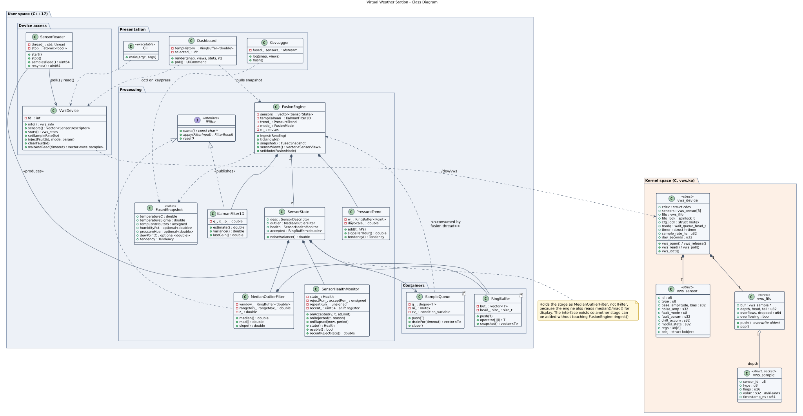
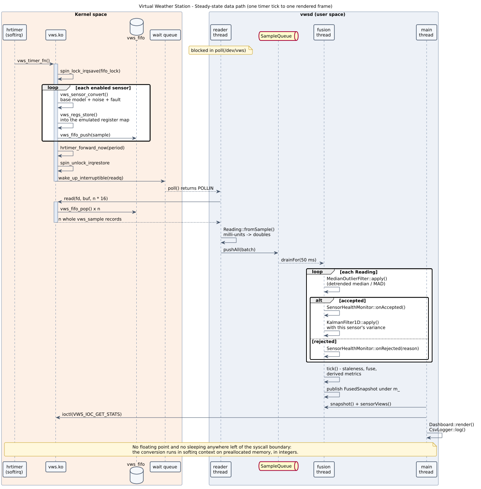
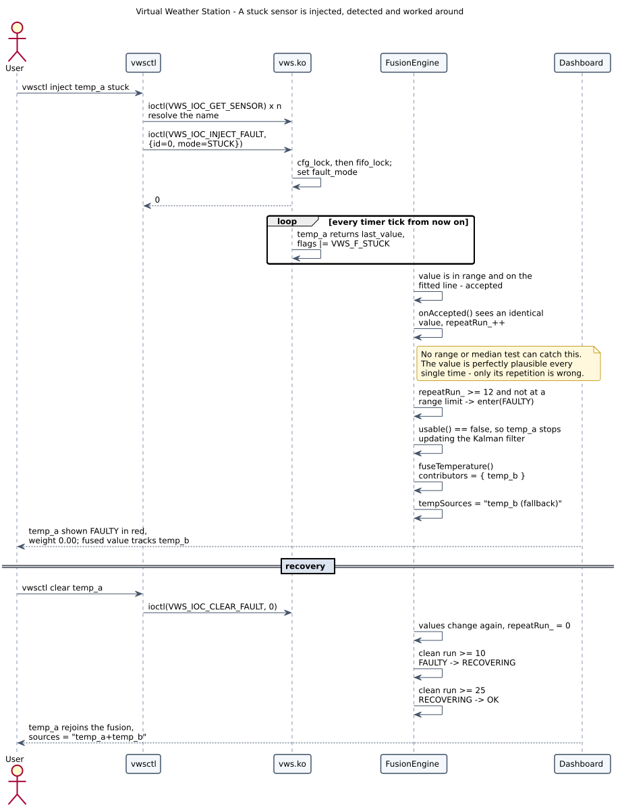
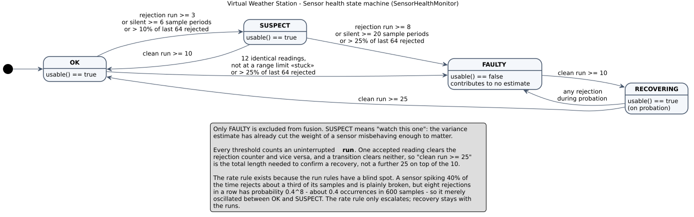
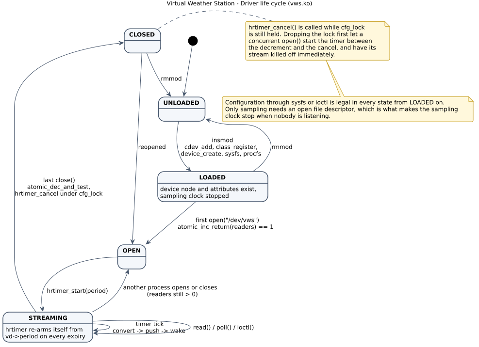
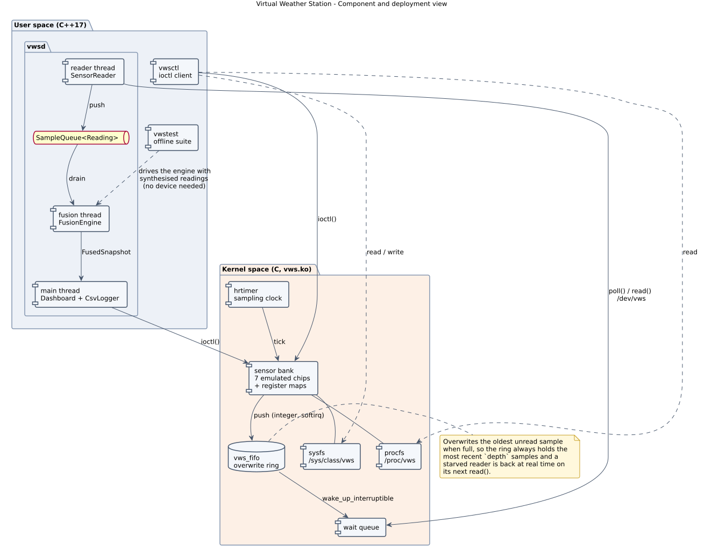

# Virtual Weather Station — UML

The `.puml` files in [`uml/`](uml/) are the authoritative source. SVG and PNG
renders are committed alongside them so the diagrams are viewable without a
toolchain; [`diagrams.html`](diagrams.html) shows all of them on one page
together with the screenshots.

Regenerate after editing any source:

```bash
make docs          # re-renders every diagram and recaptures every screenshot
```

or for the diagrams alone:

```bash
cd docs/uml && plantuml -tsvg *.puml && plantuml -tpng *.puml
```

Rendered with PlantUML 1.2020.02, entirely offline. Every diagram includes
[`uml/_style.puml`](uml/_style.puml) for a consistent look.

---

## 1. Class diagram

Kernel structures and user-space classes, with the `IFilter` hierarchy and the
containers. [`uml/01-class.puml`](uml/01-class.puml)



## 2. Sequence — steady-state data path

One timer tick through to one rendered frame: conversion in softirq context,
FIFO, wait queue, `poll()` wakeup, the filter chain, and the published
snapshot. [`uml/02-sequence-datapath.puml`](uml/02-sequence-datapath.puml)



## 3. Sequence — fault injection and fallback

A stuck sensor injected from the CLI, detected by the one mechanism that can
catch it, excluded from fusion, and recovered.
[`uml/03-sequence-fault.puml`](uml/03-sequence-fault.puml)



## 4. State machine — sensor health

`OK → SUSPECT → FAULTY → RECOVERING → OK`, with the run-based, stuck,
staleness and sustained-rate transitions.
[`uml/04-state-health.puml`](uml/04-state-health.puml)



## 5. State machine — driver life cycle

`UNLOADED → LOADED → OPEN → STREAMING → CLOSED`, including why the sampling
clock stops when nobody is listening and why the timer is cancelled under the
configuration lock. [`uml/05-state-driver.puml`](uml/05-state-driver.puml)



## 6. Component and deployment view

Processes, threads and kernel components either side of the syscall boundary.
[`uml/06-component.puml`](uml/06-component.puml)


